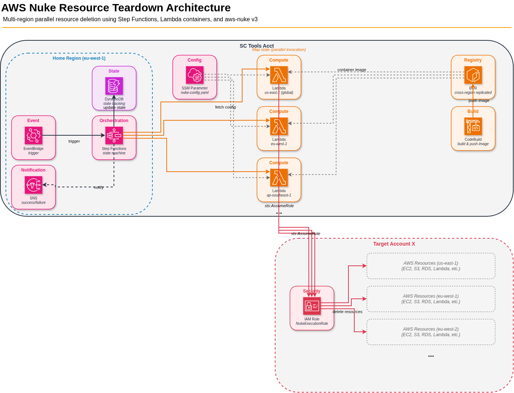

# AWS Nuke Resource Deletion Architecture



## Overview

Use aws-nuke from Lambda containers in all regions, orchestrated by Step Functions, triggered by EventBridge for a specific target account. The state machine fans out regional Lambdas in parallel, retries until all resources are deleted, and sends SNS notifications on completion.

---

## Design Review

### What's Good

1. **Container Lambda** — correct choice since aws-nuke binary exceeds layer limits
2. **Parallel regional execution** — avoids sequential bottleneck of native aws-nuke
3. **Step Functions retry loop** — handles dependency chains that require multiple passes
4. **SSM Parameter for config** — enables per-region configuration without redeploying containers
5. **SNS notification** — provides completion feedback

---

## What's Missing or Needs Attention

### 1. Global Resources Handling

IAM, Route 53, S3 buckets, and CloudFront distributions are global or us-east-1-specific. If all regional Lambdas try to delete these simultaneously, you'll get conflicts.

**Approach:**

- **us-east-1 Lambda:** Handles both global resources AND local us-east-1 resources. Its `nuke-config.yaml` uses `regions: [global, us-east-1]`.
- **All other regional Lambdas:** Each Lambda's `nuke-config.yaml` contains only its own region (e.g., `regions: [eu-west-1]`), so global resources are never touched.

**Example — us-east-1 config:**
```yaml
regions:
  - global
  - us-east-1
```

**Example — any other region (e.g., eu-west-1):**
```yaml
regions:
  - eu-west-1
```

### 2. Lambda 15-Minute Timeout

A single region with many resources (non-empty S3 buckets, EKS clusters, CloudFormation stacks) can exceed 15 minutes. The retry loop helps, but:

**Fix:** The bootstrap script should capture aws-nuke's exit status and return structured JSON (not raw stdout) indicating:
- `status`: `complete` | `resources_remaining` | `error`
- `remaining_count`: number of resources still pending
- `region`: which region this Lambda handled

### 3. Cross-Account Role Assumption

Step Functions assumes a role in the target account, but the Lambdas run in the service catalog account. The Lambdas themselves need to assume a role in the target account to actually delete resources there.

**Fix:** Pass the target account's role ARN in the Lambda event payload. The bootstrap/aws-nuke config should use that role via `AWS_ACCESS_KEY_ID`/`AWS_SECRET_ACCESS_KEY` (from STS assume-role) or configure aws-nuke's built-in account credential support.

#### IAM Roles Required (3 Total)

| # | Role | Account | Trusted By | Key Permission |
|---|------|---------|------------|----------------|
| 1 | StepFunctionsExecutionRole | Service Catalog | `states.amazonaws.com` | Invoke Lambda, DynamoDB, SNS |
| 2 | NukeLambdaExecutionRole | Service Catalog | `lambda.amazonaws.com` | `sts:AssumeRole` into target |
| 3 | NukeExecutionRole | Target | Lambda role in service catalog account | `AdministratorAccess` |

#### Trust Policies

**Role 1 — StepFunctionsExecutionRole:**
```json
{
  "Version": "2012-10-17",
  "Statement": [
    {
      "Effect": "Allow",
      "Principal": { "Service": "states.amazonaws.com" },
      "Action": "sts:AssumeRole",
      "Condition": {
        "StringEquals": { "aws:SourceAccount": "SERVICE_CATALOG_ACCOUNT_ID" }
      }
    }
  ]
}
```

**Role 2 — NukeLambdaExecutionRole:**
```json
{
  "Version": "2012-10-17",
  "Statement": [
    {
      "Effect": "Allow",
      "Principal": { "Service": "lambda.amazonaws.com" },
      "Action": "sts:AssumeRole",
      "Condition": {
        "StringEquals": { "aws:SourceAccount": "SERVICE_CATALOG_ACCOUNT_ID" }
      }
    }
  ]
}
```

**Role 3 — NukeExecutionRole (most security-sensitive — carries AdministratorAccess):**
```json
{
  "Version": "2012-10-17",
  "Statement": [
    {
      "Effect": "Allow",
      "Principal": {
        "AWS": "arn:aws:iam::SERVICE_CATALOG_ACCOUNT_ID:role/NukeLambdaExecutionRole"
      },
      "Action": "sts:AssumeRole",
      "Condition": {
        "StringEquals": {
          "sts:ExternalId": "nuke-execution-SECRET_VALUE"
        }
      }
    }
  ]
}
```

#### Permission Policies (what each role can do)

**Role 1 — StepFunctionsExecutionRole permissions:**
- `lambda:InvokeFunction` — invoke regional nuke Lambdas
- `dynamodb:PutItem`, `UpdateItem`, `GetItem`, `Query` — state tracking
- `sns:Publish` — completion/failure notifications
- `ec2:DescribeRegions` — active region discovery (if done in Step Functions directly)

**Role 2 — NukeLambdaExecutionRole permissions:**
- `sts:AssumeRole` on `arn:aws:iam::TARGET_ACCOUNT_ID:role/NukeExecutionRole`
- `ssm:GetParameter` — pull nuke-config.yaml from SSM
- `logs:CreateLogGroup`, `CreateLogStream`, `PutLogEvents` — CloudWatch logging

**Role 3 — NukeExecutionRole permissions:**
- `AdministratorAccess` (AWS managed policy) — aws-nuke needs broad permissions to discover and delete all resource types

#### Security Considerations

| Concern | Mitigation |
|---------|-----------|
| Role 3 has AdministratorAccess | Necessary for aws-nuke; only deploy Role 3 in accounts meant for cleanup |
| External ID leakage | Store in Secrets Manager, not hardcoded in CFN templates |
| Rogue Lambda in service catalog account | Trust policy on Role 3 only allows the specific Lambda execution role, not account root |
| Someone modifies the Lambda execution role | SCPs + IAM permission boundaries on the service catalog account prevent unauthorized modifications |

#### How the External ID Flows

```
Step Functions event payload:
{
  "target_account_id": "123456789012",
  "target_role_arn": "arn:aws:iam::123456789012:role/NukeExecutionRole",
  "external_id": "nuke-execution-SECRET_VALUE",
  "region": "eu-west-1"
}

Bootstrap script:
  export AWS_ASSUME_ROLE=$TARGET_ROLE_ARN
  export AWS_ASSUME_ROLE_EXTERNAL_ID=$EXTERNAL_ID
  aws-nuke run --config ... --no-prompt --no-dry-run
```

aws-nuke v3 supports `--assume-role-external-id` natively (see point 9).

### 4. Deployment Model (Centralized in Service Catalog Account)

The entire solution is deployed in the service catalog account:

- **ECR:** Single repo with cross-region replication to all enabled regions (so each regional Lambda pulls from a local ECR endpoint)
- **Lambdas:** Deployed in all enabled regions within the service catalog account
- **Cross-account access:** Each Lambda assumes a role in the target account to perform resource deletion
- **No member account deployment needed** — keeps infrastructure management centralized and avoids deploying/maintaining Lambdas across the Organization

### 5. 3-Retry Limit May Not Be Enough

Some resources take 30+ minutes to delete (CloudFront, RDS, KMS pending deletion). With 30-minute intervals and only 3 retries, you cover 90 minutes total.

**Fix:** Consider:
- 5 retries as the default
- Distinguish between "resources actively deleting" (keep retrying) vs "nothing changed between runs" (likely stuck, fail early)
- Differentiate resources in pending-deletion state (KMS, Secrets Manager) — these can't be fixed by retrying

### 6. State Tracking with DynamoDB

A single-region DynamoDB table (same region as Step Functions) tracks execution state. Step Functions updates the table after each retry cycle — Lambdas simply return their status.

**Table schema:**

| Attribute | Type | Description |
|-----------|------|-------------|
| `AccountId` | PK (String) | Target account being nuked |
| `Region` | SK (String) | AWS region (e.g., `us-east-1`) |
| `ExecutionId` | String | Step Functions execution ARN |
| `RunCount` | Number | Number of deletion cycles completed for this region |
| `Status` | String | `in_progress` \| `complete` \| `failed` \| `resources_remaining` |
| `RemainingCount` | Number | Resources still pending deletion |
| `LastUpdated` | String | ISO timestamp of last update |

**Why single-region (not global table):**
- Step Functions is the sole writer/reader — no multi-region access pattern
- Lambdas report status back via their response, not by writing to DynamoDB directly
- Avoids cost and conflict resolution overhead of global tables

**Flow:**
1. Step Functions starts execution → writes initial rows (one per region, RunCount=0)
2. Lambdas execute and return structured response
3. Step Functions updates `RunCount`, `Status`, `RemainingCount` per region
4. Choice state reads aggregated status to decide: retry, succeed, or fail

### 7. EventBridge Event Schema

Define what triggers the nuke:
- A custom event from a self-service portal?
- An AWS Organizations event (account moved to a "decommission" OU)?
- A scheduled rule?

This affects how you pass the target account ID and role ARN to the state machine.

### 8. Settings for Protected Resources

Make sure your nuke-config.yaml in SSM includes settings to auto-disable protections:

```yaml
settings:
  EC2Instance:
    DisableDeletionProtection: true
    DisableStopProtection: true
  RDSInstance:
    DisableDeletionProtection: true
  ELBv2:
    DisableDeletionProtection: true
  CloudFormationStack:
    DisableDeletionProtection: true
```

Otherwise these resources will fail on every retry.

See the full list of all 22 settings-capable resources: [aws-nuke Settings-Capable Resources](settings-capable-resources.md)

### 9. Cross-Account Execution (aws-nuke v3 Built-in Support)

aws-nuke v3 (ekristen/aws-nuke) natively supports cross-account role assumption — no manual `sts assume-role` needed.

**Requirements:**

1. **Target account** has a role (e.g., `NukeExecutionRole`) with:
   - `AdministratorAccess` policy (aws-nuke needs broad permissions)
   - Trust policy allowing the Lambda execution role in the service catalog account to assume it

2. **Lambda execution role** in the service catalog account has `sts:AssumeRole` permission on the target role

**Usage in bootstrap (CLI flag):**
```bash
aws-nuke run --assume-role arn:aws:iam::TARGET_ACCOUNT_ID:role/NukeExecutionRole \
  --config /var/task/nuke-config.yaml --no-prompt --no-dry-run 2>&1
```

**Usage via environment variable:**
```bash
export AWS_ASSUME_ROLE=arn:aws:iam::TARGET_ACCOUNT_ID:role/NukeExecutionRole
aws-nuke run --config /var/task/nuke-config.yaml --no-prompt --no-dry-run 2>&1
```

**All supported auth options (v3):**

| Method | CLI Flag | Environment Variable |
|--------|----------|---------------------|
| Assume Role ARN | `--assume-role` | `AWS_ASSUME_ROLE` |
| Session Name | `--assume-role-session-name` | `AWS_ASSUME_ROLE_SESSION_NAME` |
| External ID | `--assume-role-external-id` | `AWS_ASSUME_ROLE_EXTERNAL_ID` |
| Profile | `--profile` | `AWS_PROFILE` |
| Region | `--region` | `AWS_REGION` |

**Recommended approach for this architecture:**

The Lambda event payload (from Step Functions) includes the target role ARN, external ID, and execution mode. The bootstrap script uses the Lambda Runtime API to receive invocations, extracts cross-account parameters, and passes them to aws-nuke via environment variables.

**Expected event payload from Step Functions:**
```json
{
  "target_role_arn": "arn:aws:iam::123456789012:role/NukeExecutionRole",
  "external_id": "nuke-execution-SECRET_VALUE",
  "region": "eu-west-1",
  "no_dry_run": true
}
```

**Full bootstrap script (Lambda custom runtime):**
```bash
#!/bin/bash
set -euo pipefail

# Fetch nuke config from SSM (once per cold start)
aws ssm get-parameter \
  --name "/aws-nuke/config" \
  --with-decryption \
  --query "Parameter.Value" \
  --output text > /tmp/nuke-config.yaml

# Lambda custom runtime loop
while true; do
  HEADERS="$(mktemp)"
  EVENT_DATA=$(curl -sS -LD "$HEADERS" "http://${AWS_LAMBDA_RUNTIME_API}/2018-06-01/runtime/invocation/next")
  REQUEST_ID=$(grep -Fi Lambda-Runtime-Aws-Request-Id "$HEADERS" | tr -d '[:space:]' | cut -d: -f2)

  # Extract cross-account parameters from Step Functions payload
  export AWS_ASSUME_ROLE=$(echo "$EVENT_DATA" | jq -r '.target_role_arn')
  export AWS_ASSUME_ROLE_EXTERNAL_ID=$(echo "$EVENT_DATA" | jq -r '.external_id')
  export AWS_ASSUME_ROLE_SESSION_NAME="nuke-$(echo "$EVENT_DATA" | jq -r '.region')-$(date +%s)"
  NO_DRY_RUN=$(echo "$EVENT_DATA" | jq -r '.no_dry_run // "false"')

  # Build aws-nuke command
  NUKE_CMD="aws-nuke run --config /tmp/nuke-config.yaml --no-prompt --no-alias-check"
  if [ "$NO_DRY_RUN" = "true" ]; then
    NUKE_CMD="$NUKE_CMD --no-dry-run"
  fi

  echo "=== aws-nuke run (region=$(echo "$EVENT_DATA" | jq -r '.region'), no_dry_run=$NO_DRY_RUN) ==="
  RESPONSE=$($NUKE_CMD 2>&1 | tee /dev/stderr || true)

  # Return result to Lambda Runtime API
  curl -sS -X POST "http://${AWS_LAMBDA_RUNTIME_API}/2018-06-01/runtime/invocation/$REQUEST_ID/response" -d "$RESPONSE"
done
```

**How it works:**
1. On cold start, fetches `nuke-config.yaml` from SSM Parameter Store (once)
2. Enters the Runtime API loop — blocks until Step Functions invokes the Lambda
3. Extracts `target_role_arn`, `external_id`, and `no_dry_run` from the event payload
4. Sets `AWS_ASSUME_ROLE` and `AWS_ASSUME_ROLE_EXTERNAL_ID` — aws-nuke reads these and internally calls `sts:AssumeRole`
5. Runs aws-nuke with or without `--no-dry-run` based on the event
6. Returns raw output to the caller and waits for the next invocation

This keeps credentials handling clean — aws-nuke manages the STS call internally via the AWS SDK, passing the external ID automatically.

> **See also:** [Create Docker Container with CodeBuild](create-docker-container-with-codebuild.md) — Point 2 (bootstrap details) and Point 3 Option B (inline buildspec with NO_SOURCE).

**Note:** STS session token expiry is not a concern here since Lambda's max timeout (15 min) is well within the default 1-hour session duration.

---

## Improved Architecture

```
EventBridge (target account event)
    → Step Functions (service catalog account)
        → Step 1: Validate target account (is it in the OU? not in blocklist?)
        → Step 2: Discover active regions in target account
        → Step 3: Map state — fan out Lambda per active region (all in service catalog account)
            - us-east-1 Lambda: assumes role in target, handles global + us-east-1 resources
            - Other Lambdas: assumes role in target, handles their region only
        → Step 4: Collect results, update DynamoDB state table
        → Step 5: Choice state
            - All regions complete → SNS success
            - Resources remaining + retries < 5 + progress detected → Wait 30 min → Go to Step 3
            - No progress between runs → SNS failure (stuck resources)
            - Resources remaining + retries >= 5 → SNS failure (with details per region)
```

### Key Additions

- **Account validation step** — prevents nuking the wrong account
- **Active region discovery** — only invoke Lambdas in regions that have resources
- **Structured Lambda response** — enables intelligent retry decisions
- **Separate global vs regional config** — us-east-1 uses `regions: [global, us-east-1]`, others use their own region only
- **DynamoDB state tracking** — Step Functions updates run count and status per region after each cycle
- **Cross-account via aws-nuke** — Lambdas use `--assume-role` flag (no manual STS calls needed)
- **No-progress early termination** — fails early if resources are stuck rather than exhausting all retries

---

## Alternative Options

| Approach | Pros | Cons |
|----------|------|------|
| **Lambda + Step Functions** | Serverless, cost-efficient, parallel | 15-min timeout, complex retry logic |
| **Fargate + Step Functions** | No timeout limit, same orchestration | Higher cost if idle, slower cold start |
| **Hybrid: Lambda first pass, Fargate for stragglers** | Best of both — fast for most, patient for slow resources | More complex deployment |
| **AWS Organizations SCP + Lambda** | Apply deny-all SCP first to prevent new resource creation during cleanup | Adds safety but doesn't help with deletion speed |

### Recommendation

Stick with Lambda + Step Functions design but add:
1. An SCP applied to the target account during nuke (prevent new resource creation)
2. Global resource isolation to us-east-1
3. Structured Lambda responses
4. 5 retries with "no progress" early termination
5. Account validation as the first step
