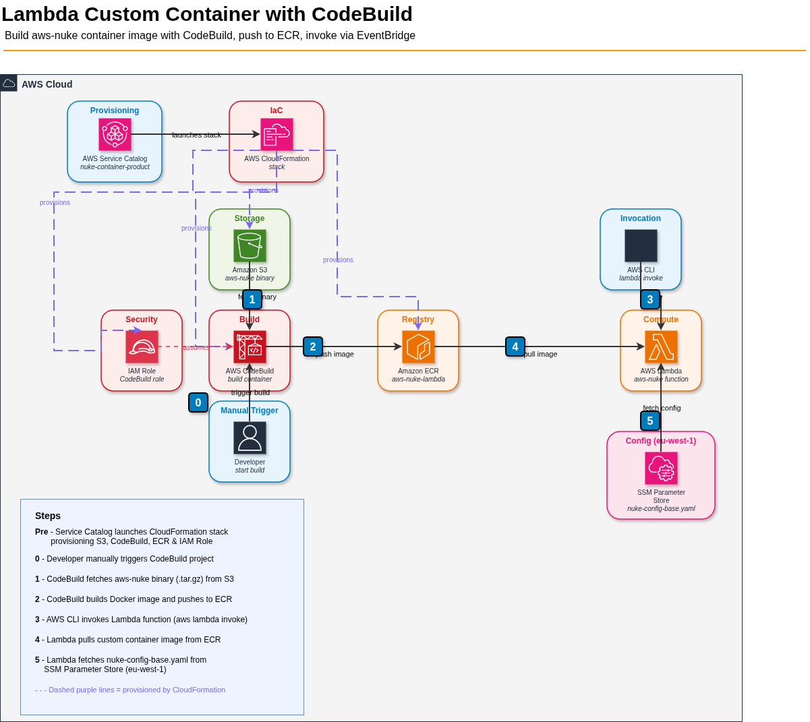

# Build Lambda Custom Container Image with CodeBuild (aws-nuke)

Use CodeBuild to build a Docker image that includes `aws-nuke`, push it to ECR, then deploy it as a Lambda function.



## Prerequisites

- AWS CLI installed and configured
- Docker installed (for local testing)
- An ECR repository created in your target region
- A CodeBuild service role with ECR and CloudWatch Logs permissions
- A Lambda execution role with permissions for resources aws-nuke will delete
- A `nuke-config.yaml` file defining which resources to nuke (and which to exclude)

## 1. Dockerfile

### Option 1: Download from GitHub releases

```dockerfile
FROM public.ecr.aws/lambda/provided:al2023

# Install aws-nuke
RUN curl -sL https://github.com/ekristen/aws-nuke/releases/download/v3.64.4/aws-nuke-v3.64.4-linux-amd64.tar.gz | tar xz -C /usr/local/bin aws-nuke

# Copy your Lambda handler (bootstrap script)
COPY bootstrap ${LAMBDA_RUNTIME_DIR}/bootstrap
RUN chmod 755 ${LAMBDA_RUNTIME_DIR}/bootstrap

CMD ["handler"]
```

### Option 2: Download from S3 bucket

```dockerfile
FROM public.ecr.aws/lambda/provided:al2023

# Install aws-nuke from S3
RUN aws s3 cp s3://<BUCKET_NAME>/aws-nuke/aws-nuke-v3.64.4-linux-amd64.tar.gz /tmp/aws-nuke.tar.gz \
    && tar xz -C /usr/local/bin aws-nuke -f /tmp/aws-nuke.tar.gz \
    && rm /tmp/aws-nuke.tar.gz

# Copy your Lambda handler (bootstrap script)
COPY bootstrap ${LAMBDA_RUNTIME_DIR}/bootstrap
RUN chmod 755 ${LAMBDA_RUNTIME_DIR}/bootstrap

CMD ["handler"]
```

> **Note:** The CodeBuild service role must have `s3:GetObject` permission on the bucket. The AWS CLI is pre-installed in the CodeBuild environment, so `aws s3 cp` is available during `docker build` if you use a build stage or pass credentials via build args. Alternatively, download the file in the buildspec `pre_build` phase and use `COPY` in the Dockerfile instead:
>
> ```yaml
> # In buildspec pre_build phase:
> - aws s3 cp s3://<BUCKET_NAME>/aws-nuke/aws-nuke-v3.64.4-linux-amd64.tar.gz aws-nuke.tar.gz
> ```
> ```dockerfile
> # In Dockerfile:
> COPY aws-nuke.tar.gz /tmp/aws-nuke.tar.gz
> RUN tar xz -C /usr/local/bin aws-nuke -f /tmp/aws-nuke.tar.gz && rm /tmp/aws-nuke.tar.gz
> ```

## 2. bootstrap (Custom Runtime Entry Point)

The `bootstrap` script is executed when the Lambda execution environment starts. It runs a loop that polls the Lambda Runtime API for invocations:

```bash
#!/bin/bash
set -euo pipefail

# Lambda custom runtime loop
while true; do
  # Get next invocation
  HEADERS="$(mktemp)"
  EVENT_DATA=$(curl -sS -LD "$HEADERS" "http://${AWS_LAMBDA_RUNTIME_API}/2018-06-01/runtime/invocation/next")
  REQUEST_ID=$(grep -Fi Lambda-Runtime-Aws-Request-Id "$HEADERS" | tr -d '[:space:]' | cut -d: -f2)

  # Run aws-nuke — stdout/stderr is sent to CloudWatch Logs automatically
  echo "=== aws-nuke help ==="
  aws-nuke -h 2>&1 | tee /dev/stderr

  echo "=== aws-nuke resource-types ==="
  aws-nuke resource-types 2>&1 | tee /dev/stderr

  echo "=== aws-nuke run ==="
  RESPONSE=$(aws-nuke run --config /var/task/nuke-config.yaml --no-prompt --no-alias-check 2>&1 | tee /dev/stderr || true)

  # Send response
  curl -sS -X POST "http://${AWS_LAMBDA_RUNTIME_API}/2018-06-01/runtime/invocation/$REQUEST_ID/response" -d "$RESPONSE"
done
```

### Understanding the bootstrap Script

When Lambda runs a custom container with the `provided` runtime, it looks for an executable named `bootstrap` to start your function. There is no built-in language runtime (like Python or Node.js) — your script **is** the runtime.

Here's what each part does:

| Line | Purpose |
|------|---------|
| `set -euo pipefail` | Exit on error (`-e`), treat unset variables as errors (`-u`), fail on any pipe failure (`-o pipefail`). Ensures the script doesn't silently continue after failures. |
| `while true; do` | Keeps the runtime alive between invocations. Lambda reuses the same execution environment for multiple requests (warm starts). |
| `HEADERS="$(mktemp)"` | Creates a temp file to store HTTP response headers from the Runtime API. |
| `curl ... /invocation/next` | **Long-polls** the Lambda Runtime API. This call blocks until a new invocation arrives. Lambda provides the `AWS_LAMBDA_RUNTIME_API` environment variable automatically. |
| `REQUEST_ID=$(grep ...)` | Extracts the unique request ID from the response headers. This ID is required when sending the response back. |
| `aws-nuke ... \| tee /dev/stderr` | Runs the command and simultaneously streams output to stderr (CloudWatch Logs) while capturing it in `$RESPONSE`. |
| `|| true` | Prevents the script from exiting if aws-nuke returns a non-zero exit code (which it does when it deletes resources). |
| `curl ... /invocation/$REQUEST_ID/response` | Sends the function's output back to the Lambda Runtime API, completing the invocation. |

**Flow diagram:**

```
Lambda invoked
      │
      ▼
┌─────────────────────────┐
│ curl .../invocation/next │ ◄── blocks until invocation arrives
└────────────┬────────────┘
             │
             ▼
┌─────────────────────────┐
│   Extract REQUEST_ID    │
└────────────┬────────────┘
             │
             ▼
┌─────────────────────────┐
│   Run aws-nuke commands │ ──► output goes to CloudWatch
└────────────┬────────────┘
             │
             ▼
┌─────────────────────────┐
│ POST .../response        │ ──► sends result back to caller
└────────────┬────────────┘
             │
             ▼
        loop (wait for next invocation)
```

> **Key point:** If the bootstrap script exits (crashes, unhandled error), Lambda reports an invocation error and may restart the execution environment. The `while true` loop and `|| true` on aws-nuke ensure the runtime stays alive across invocations.

## 3. File Placement

Since we are not using a source repository, all files (Dockerfile, bootstrap) are created inline during the build. There are two options:

### Option A: Use a source repository

Place the `Dockerfile`, `bootstrap`, and `buildspec.yml` in the **root of your source repository**:

```
/
├── Dockerfile
├── bootstrap
└── buildspec.yml
```

The buildspec references the Dockerfile via `docker build .` which uses the current directory as build context.

### Option B: No source repository (inline buildspec with `NO_SOURCE`)

Use CodeBuild's `NO_SOURCE` type and create all files inline within the buildspec using heredocs:

```yaml
version: 0.2

env:
  variables:
    ECR_REPO: <ACCOUNT_ID>.dkr.ecr.<REGION>.amazonaws.com/aws-nuke-lambda
    IMAGE_TAG: latest

phases:
  pre_build:
    commands:
      - aws ecr get-login-password --region $AWS_DEFAULT_REGION | docker login --username AWS --password-stdin $ECR_REPO
  build:
    commands:
      # Create Dockerfile inline
      - |
        cat > Dockerfile <<'EOF'
        FROM public.ecr.aws/lambda/provided:al2023
        RUN curl -sL https://github.com/ekristen/aws-nuke/releases/download/v3.64.4/aws-nuke-v3.64.4-linux-amd64.tar.gz | tar xz -C /usr/local/bin aws-nuke
        COPY bootstrap ${LAMBDA_RUNTIME_DIR}/bootstrap
        RUN chmod 755 ${LAMBDA_RUNTIME_DIR}/bootstrap
        CMD ["handler"]
        EOF
      # Create bootstrap inline
      - |
        cat > bootstrap <<'EOF'
        #!/bin/bash
        set -euo pipefail
        while true; do
          HEADERS="$(mktemp)"
          EVENT_DATA=$(curl -sS -LD "$HEADERS" "http://${AWS_LAMBDA_RUNTIME_API}/2018-06-01/runtime/invocation/next")
          REQUEST_ID=$(grep -Fi Lambda-Runtime-Aws-Request-Id "$HEADERS" | tr -d '[:space:]' | cut -d: -f2)
          echo "=== aws-nuke help ===" && aws-nuke -h 2>&1 | tee /dev/stderr
          echo "=== aws-nuke resource-types ===" && aws-nuke resource-types 2>&1 | tee /dev/stderr
          echo "=== aws-nuke run ==="
          RESPONSE=$(aws-nuke run --config /var/task/nuke-config.yaml --no-prompt --no-alias-check 2>&1 | tee /dev/stderr || true)
          curl -sS -X POST "http://${AWS_LAMBDA_RUNTIME_API}/2018-06-01/runtime/invocation/$REQUEST_ID/response" -d "$RESPONSE"
        done
        EOF
      - chmod +x bootstrap
      - docker build -t $ECR_REPO:$IMAGE_TAG .
  post_build:
    commands:
      - docker push $ECR_REPO:$IMAGE_TAG
```

Create the project with:

```bash
aws codebuild create-project \
  --name aws-nuke-build \
  --source '{"type": "NO_SOURCE", "buildspec": "buildspec.yml"}' \
  --environment '{"type": "LINUX_CONTAINER", "image": "aws/codebuild/amazonlinux-x86_64-standard:5.0", "computeType": "BUILD_GENERAL1_SMALL", "privilegedMode": true}' \
  --service-role arn:aws:iam::<ACCOUNT_ID>:role/<CODEBUILD_ROLE>
```

Alternatively, pass the buildspec as a file using the CLI:

```bash
aws codebuild create-project \
  --name aws-nuke-build \
  --source "$(jq -n --rawfile bs buildspec.yml '{type: "NO_SOURCE", buildspec: $bs}')" \
  --environment '{"type": "LINUX_CONTAINER", "image": "aws/codebuild/amazonlinux-x86_64-standard:5.0", "computeType": "BUILD_GENERAL1_SMALL", "privilegedMode": true}' \
  --service-role arn:aws:iam::<ACCOUNT_ID>:role/<CODEBUILD_ROLE>
```

## 4. Setup Steps

1. **Create an ECR repository:**
   ```bash
   aws ecr create-repository --repository-name aws-nuke-lambda --region <REGION>
   ```

2. **Create the CodeBuild project** with:
   - Environment: `aws/codebuild/amazonlinux-x86_64-standard:5.0` (Amazon Linux 2023)
   - **Privileged mode enabled** (required for Docker builds)
   - Source type: `NO_SOURCE` (for Option B) or your repo (for Option A)
   - IAM role with permissions (see [CodeBuild IAM Role Permissions](#codebuild-iam-role-permissions) below)

3. **Create the Lambda function from the image:**
   ```bash
   aws lambda create-function \
     --function-name aws-nuke-function \
     --package-type Image \
     --code ImageUri=<ACCOUNT_ID>.dkr.ecr.<REGION>.amazonaws.com/aws-nuke-lambda:latest \
     --role arn:aws:iam::<ACCOUNT_ID>:role/<LAMBDA_ROLE> \
     --timeout 900 \
     --memory-size 512
   ```

## CodeBuild IAM Role Permissions

The CodeBuild service role requires the following permissions:

```json
{
  "Version": "2012-10-17",
  "Statement": [
    {
      "Effect": "Allow",
      "Action": [
        "ecr:BatchCheckLayerAvailability",
        "ecr:CompleteLayerUpload",
        "ecr:GetAuthorizationToken",
        "ecr:InitiateLayerUpload",
        "ecr:PutImage",
        "ecr:UploadLayerPart"
      ],
      "Resource": "*"
    },
    {
      "Effect": "Allow",
      "Action": [
        "logs:CreateLogGroup",
        "logs:CreateLogStream",
        "logs:PutLogEvents"
      ],
      "Resource": "*"
    }
  ]
}
```

> **Note:** For least privilege, scope the ECR actions (except `ecr:GetAuthorizationToken`) to your repository ARN: `arn:aws:ecr:<REGION>:<ACCOUNT_ID>:repository/aws-nuke-lambda`. `ecr:GetAuthorizationToken` must remain `Resource: "*"`.

## Key Considerations

- **Timeout**: Set Lambda timeout to max (900s) since aws-nuke can take time.
- **Memory**: 512 MB+ recommended for aws-nuke.
- **IAM**: The Lambda execution role needs permissions for whatever resources aws-nuke will delete.
- **Image size**: The aws-nuke binary is ~275 MB uncompressed, but within the 10 GB container image limit.
- **Config**: Bundle your `nuke-config.yaml` in the image or fetch it from S3 at runtime.

## Further Improvements

Instead of bundling `nuke-config.yaml` in the container image, you can fetch it at runtime from a managed configuration service.

### Option 1: SSM Parameter Store

Store the config as an SSM parameter and fetch it at cold start in the `bootstrap` script:

```bash
# Fetch nuke config from SSM (add before the runtime loop)
aws ssm get-parameter \
  --name "/aws-nuke/config" \
  --with-decryption \
  --query "Parameter.Value" \
  --output text > /tmp/nuke-config.yaml
```

Store the config:

```bash
aws ssm put-parameter \
  --name "/aws-nuke/config" \
  --type String \
  --value file://nuke-config.yaml
```

Lambda role permission required:

```json
{
  "Effect": "Allow",
  "Action": "ssm:GetParameter",
  "Resource": "arn:aws:ssm:<REGION>:<ACCOUNT_ID>:parameter/aws-nuke/config"
}
```

> **Note:** SSM standard parameters have an 8KB size limit. Use Advanced tier for larger configs, or consider AppConfig.

### Option 2: AWS AppConfig

Use the AppConfig Lambda extension (runs locally on port 2772) for built-in caching, validation, and safe deployments:

```bash
# Fetch nuke config from AppConfig Lambda extension (add before the runtime loop)
curl -s "http://localhost:2772/applications/aws-nuke/environments/prod/configurations/nuke-config" \
  > /tmp/nuke-config.yaml
```

Setup:

1. **Add the AppConfig Lambda extension layer** to your function:
   ```
   arn:aws:lambda:<REGION>:080313895113:layer:AWS-AppConfig-Extension:latest
   ```

2. **Create and deploy the configuration:**
   ```bash
   aws appconfig create-application --name aws-nuke
   aws appconfig create-environment --application-id <APP_ID> --name prod
   aws appconfig create-configuration-profile \
     --application-id <APP_ID> --name nuke-config \
     --location-uri hosted --type AWS.Freeform
   aws appconfig create-hosted-configuration-version \
     --application-id <APP_ID> \
     --configuration-profile-id <PROFILE_ID> \
     --content fileb://nuke-config.yaml \
     --content-type "application/x-yaml"
   aws appconfig start-deployment \
     --application-id <APP_ID> --environment-id <ENV_ID> \
     --configuration-profile-id <PROFILE_ID> \
     --configuration-version 1 \
     --deployment-strategy-id AppConfig.AllAtOnce
   ```

3. **Lambda role permission required:**
   ```json
   {
     "Effect": "Allow",
     "Action": [
       "appconfig:GetLatestConfiguration",
       "appconfig:StartConfigurationSession"
     ],
     "Resource": "arn:aws:appconfig:<REGION>:<ACCOUNT_ID>:application/<APP_ID>/environment/<ENV_ID>/configuration/<PROFILE_ID>"
   }
   ```

### Comparison

| | SSM Parameter Store | AWS AppConfig |
|---|---|---|
| Size limit | 8KB (standard) | 1MB |
| Validation | None | JSON Schema or Lambda validator |
| Deployment | Instant | Gradual rollout strategies |
| Caching | Manual | Built-in via Lambda extension |
| Cost | Free (standard tier) | Per config retrieval |

## Lambda Role Permission and Resource-Based Policy

Since the Lambda directly runs aws-nuke (no cross-account assumption), the Lambda execution role itself needs broad permissions.

### IAM Role Policy

```json
{
  "Version": "2012-10-17",
  "Statement": [
    {
      "Sid": "NukeResourceDeletion",
      "Effect": "Allow",
      "Action": "*",
      "Resource": "*"
    }
  ]
}
```

### Trust Policy

```json
{
  "Version": "2012-10-17",
  "Statement": [
    {
      "Effect": "Allow",
      "Principal": {
        "Service": "lambda.amazonaws.com"
      },
      "Action": "sts:AssumeRole"
    }
  ]
}
```

### Securing the Lambda

Since the role has full access, security shifts to **controlling who can invoke the function**:

1. **Restrict invocation** — Use a resource-based policy to limit who/what can trigger the Lambda:
   ```json
   {
     "Sid": "RestrictInvocation",
     "Effect": "Deny",
     "Action": "lambda:InvokeFunction",
     "Resource": "arn:aws:lambda:<REGION>:<ACCOUNT_ID>:function:aws-nuke-function",
     "Principal": "*",
     "Condition": {
       "StringNotEquals": {
         "aws:PrincipalArn": "arn:aws:iam::<ACCOUNT_ID>:role/<TRUSTED_ROLE>"
       }
     }
   }
   ```

2. **Protect the Lambda and role from modification** — Use an SCP or IAM permissions boundary to prevent changes to the function or its role.

3. **Use nuke-config.yaml filters** — Exclude critical resources (the Lambda itself, its role, VPC, etc.) from deletion.

4. **Only deploy in sandbox/non-production accounts** — Never attach `Action: "*"` to a Lambda role in a production account.

> **Note:** The [AWS Innovation Sandbox solution](https://docs.aws.amazon.com/solutions/latest/innovation-sandbox-on-aws/solution-overview.html) uses the same approach — granting administrative access to the cleanup role — but secures it through restricted trust policies, SCPs, and treating the host account as a highly sensitive asset.

## Testing Locally

Use the [Lambda Runtime Interface Emulator (RIE)](https://github.com/aws/aws-lambda-runtime-interface-emulator) to test the container image locally before deploying:

```bash
# Build the image
docker build -t aws-nuke-lambda .

# Run with RIE (emulates the Lambda Runtime API locally)
docker run -d -p 9000:8080 \
  -e AWS_ACCESS_KEY_ID=<KEY> \
  -e AWS_SECRET_ACCESS_KEY=<SECRET> \
  -e AWS_DEFAULT_REGION=<REGION> \
  aws-nuke-lambda

# Invoke the function
curl -XPOST "http://localhost:9000/2015-03-31/functions/function/invocations" -d '{}'
```

> **Note:** The `provided:al2023` base image includes RIE already. If using a non-AWS base image, you'd need to install it separately.
